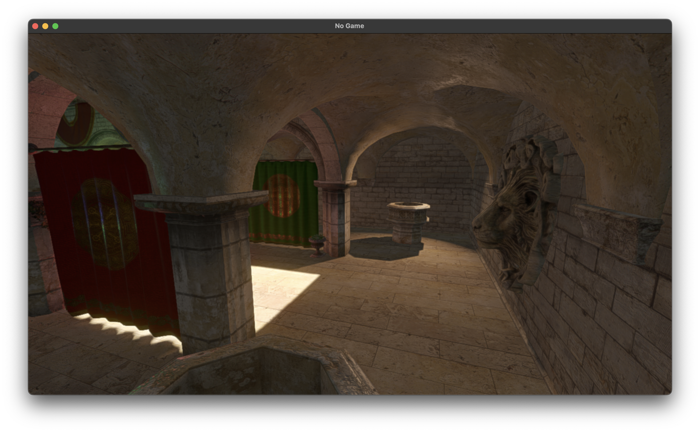

# My Game Engine

This is my attempt at a simple Vulkan-based game engine.

## Demos

- Asteroids game: https://youtu.be/uIyIgphtwv8

## Screenshots

## Goal

To create a simple game engine with the following features:
- GPU accelerated rendering in Vulkan
- An Entity Component System
- A Simple Physics System

### Graphics

The graphics system consists of two renderpass subpasses:
- a GBuffer pass, which renders surface information to a geometry buffer consisting of five textures:
    - albedo, the surface's base colour
    - normal, the direction the surface is facing
    - ambient occlusion - roughness - metallness, the physical properties of the surface
    - emissive, how much light the surface is emitting
    - and depth, analogous to the distance the surface is from the camera
- and a lighting pass, which computes surface illumination from each light in the scene and outputs to the emissive texture

TODO!
- Add a post processing subpass
- Add a TAA subpass

### Physics

The physics system is implemented within the ECS framework. It currently supports only Sphere-Sphere collision. It uses a Binary Space Partition Tree to reduce the number of pairs of colliders it needs to check collisions between.

The Binary Space Partition Tree works as follows:
- Determine the mean position of all colliders
- Determine the variance of positions of colliders for the X, Y, and Z axes
- Select the axis with the highest variance
- You now have a plane perpendicular to the selected axis at the position of the mean point
- Split the possible colliders into two subtrees:
    - colliders with a bounding box at least partially on one side of this plane,
    - and colliders with a bounding box at least partially on the other side of this plane
- Repeat for each subtree until they reach a maximum depth or a minimum number of colliders

This algorithm is not free, and can in fact be quite costly. I have found that limiting the depth to a maximum of 10 splits, and limiting each set to contain no less that 10 colliders produces the best results and meant the game could support 8,000 entities while maintaining a smooth framerate, when with a brute force approach it could support only 1,000.
